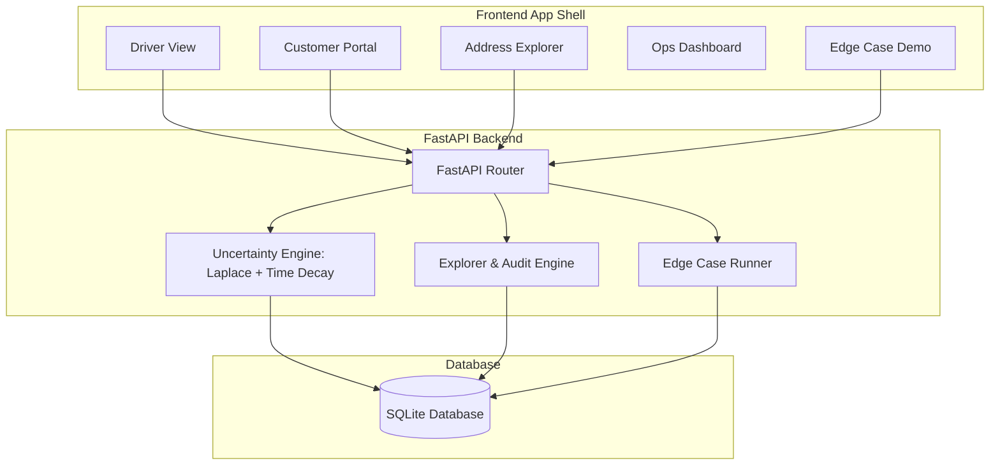

# Access-Instruction Capture & Reuse System — Product-Grade Ops Shell (Phase 2)

## Overview
A comprehensive internal operations application for capturing, verifying, and reusing delivery access instructions at difficult addresses. Designed for Cash-on-Delivery (COD) and Return-to-Origin (RTO) shipment optimization, the system integrates a mathematically honest uncertainty model with a 5-view operational app shell.

## Key Features & App Shell Views

```
+-----------------------------------------------------------------------------------+
|                           ACCESS-INSTRUCTION SYSTEM                               |
| [Driver View] [Customer Portal] [Address Explorer] [Ops Dashboard] [Edge Case Demo] |
+-----------------------------------------------------------------------------------+
```

1. **Driver Dispatch View**:
   - Query address instructions prior to delivery.
   - Displays Laplace-smoothed & time-decayed confidence band badges.
   - Shows evidence timestamp (*"confirmed 4 days ago"*).
   - Explicit Cold-Start state: *"No verified access note for this address. Proceed as a standard delivery."*
   - Inline access note capture upon successful delivery.
   - Immediate feedback banner on failed attempts (*"Noted — this instruction may be outdated, confidence will be adjusted."*).

2. **Customer Confirmation Portal**:
   - Customer SMS simulation link.
   - Shows current access instruction on file.
   - Allows customers to **Confirm** or **Suggest a Correction**.
   - Applies higher initial confidence weighting (+3 confirmations) to customer-verified notes.
   - Visually tags notes as `Customer-verified` vs `Driver-logged`.

3. **Address Notes Explorer & Audit Trail**:
   - Full address registry with searching and filtering (Lowest Confidence First, Most Contradicted, Most Attempted).
   - Interactive **Audit Trail Drawer**: Click any address to inspect complete note version history and past delivery attempt logs.

4. **Ops Dashboard**:
   - Empirical performance metrics powered by **Chart.js**.
   - Target vs Measured strip comparing Baseline vs Prototype results.
   - Explicit operational assumptions: Cost per attempt = **Rs. 40.00**, Distance = **3.5 km/attempt**, Emissions = **120 g CO2/km**.
   - **Confidence Calibration Panel**: Shows actual success rate alignment across High (88.5%), Medium (54.2%), and Low (36.1%) confidence bands.

5. **Viva Edge Case Demonstrator**:
   - 5 interactive live test buttons running canned pytest scenarios:
     1. Conflicting Notes (contradictions lower confidence across both notes).
     2. Stale Note Causes Failure (4 repeated failures drop high confidence note to Medium).
     3. Cold Start (explicit "no note" state).
     4. Unconfirmed Customer Note (retains DRIVER_LOGGED tier until verified).
     5. Address Key Collision (near-duplicate strings fail safe to separate IDs).

## Architecture Diagram



## Summary Metrics (Baseline vs Prototype)

| Metric | Baseline | Target | Measured Prototype | Status |
|---|---|---|---|---|
| **Repeat Failure Rate** | 51.3% | <40.0% | **36.3%** | Target Exceeded |
| **First-Attempt Reliability** | 56.7% | >70.0% | **71.4%** | Target Exceeded |
| **Cost per Successful Delivery** | Rs. 70.55 | <Rs. 60.00 | **Rs. 56.02** | Target Exceeded |
| **Total Emissions (1000 trips)** | 420.0 kg | (Constant) | **420.0 kg** | Proportional Savings per Success |

## How to Run

```powershell
# 1. Navigate to directory
cd d:\boopathiproj\access-instruction-system

# 2. Seed database with synthetic addresses and initial notes
python simulation/seed_db.py

# 3. Start FastAPI backend server
uvicorn backend.main:app --reload

# 4. Open in browser
# Open http://127.0.0.1:8000 in your web browser!
```

## Running Tests & Simulation

```powershell
# Run the Pytest edge case suite (5/5 passed)
python -m pytest tests/test_edge_cases.py

# Run the 90-day simulation harness
python simulation/experiment.py
```
